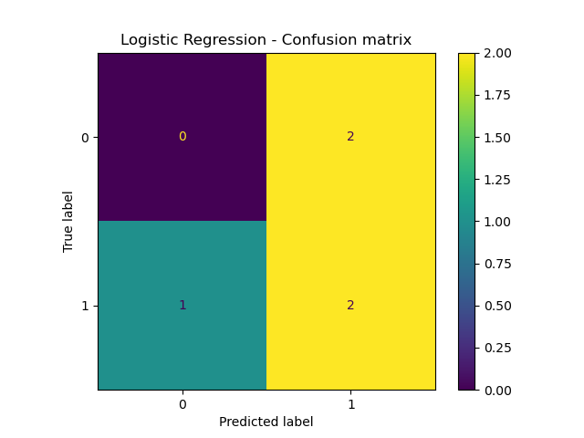
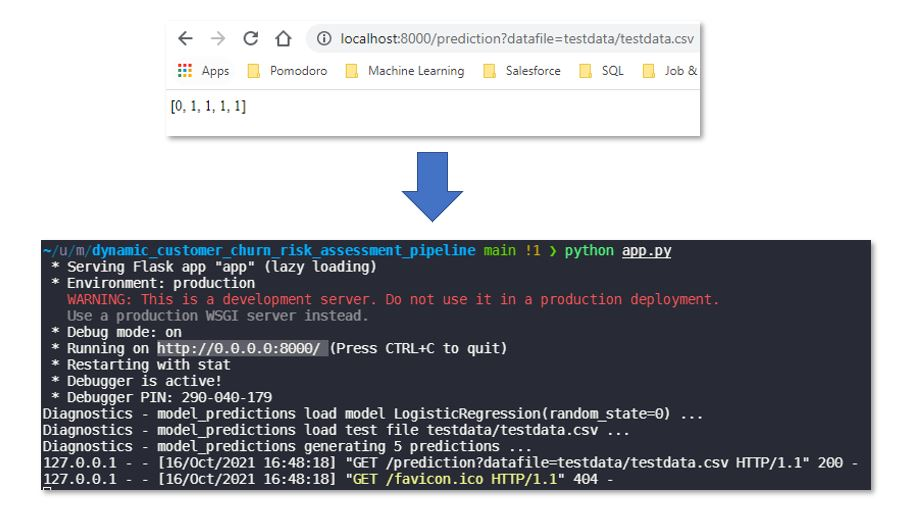
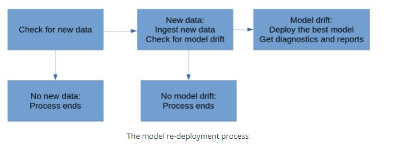

# Dynamic Customer Churn Risk Assessment ML Workflow

**Project description:** In this project, we focus on deploying an ML model that can continuously compute customer attrition risk every time new data is available. The goal is to reduce the risk that some clients will exit their contracts likely leading to a decrease in revenue. This will enable the client support to contact clients with the highest churn risk to minimize attrition.

In addition, the pipeline regularly monitors the model's performance to ensure that it remains accurate and up-to-date. The workflow's logic is build on python scripts that re-train, re-deploy, monitor, and report on the ML model so that client risk assessments that are as up to date and accurate as possible.

The focus of this project is the end to end workflow and process while modelling here takes a back seat.

Source: [Udacity - Machine Learning DevOps Engineer Nano-degree](https://www.udacity.com/course/machine-learning-dev-ops-engineer-nanodegree--nd0821)

---

## Pipeline components and Steps Overview

The different component of the pipeline are: 
  * [Data ingestion](#1-data-ingestion)
  * [Training, scoring, and deploying](#2-training,-scoring,-and-deploying)
  * [Diagnostics](#3-diagnostics)
  * [Reporting](#4-reporting)
  * [Model API](#5-model-api)
  * [Process Automation](#6-process-automation)
---

## Project Set-up - Directories and Files
### Overview of the CI/CD Pipeline's Code Organization

```
├── README.md
├── apicalls.py
├── app.py
├── config.json
├── cron.py
├── deployment.py
├── diagnostics.py
├── fullprocess.py
├── ingesteddata
│   └── finaldata.csv
├── ingestion.py
├── logs
│   ├── apireturns.txt
│   ├── cron.txt
│   ├── ingestedfiles.txt
│   ├── latestscore.txt
│   ├── model.txt
│   └── outdated.txt
├── models
│   ├── apireturns2.txt
│   ├── confusionmatrix2.png
│   └── trainedmodel.pkl
├── practicedata
│   ├── dataset1.csv
│   └── dataset2.csv
├── practicemodels
├── production_deployment
│   ├── ingestedfiles.txt
│   ├── latestscore.txt
│   └── trainedmodel.pkl
├── reporting.py
├── requirements.txt
├── scoring.py
├── sourcedata
│   ├── dataset3.csv
│   └── dataset4.csv
├── testdata
│   └── testdata.csv
├── training.py
└── wsgi.py
```
### Directories
* ``practicedata``: directory which contains data used for test and practice purposes.
* ``sourcedata``: directory which contains data that needed to load and train risk models.
* ``ingesteddata``: directory which contains the compiled datasets that the ingestion script has processed.
* ``testdata``: directory contains data used for testing and evaluating models.
* ``models``: directory which contains ML models that created and ready for production.
* ``practicemodels``: directory which contains ML models that you created for test and practice purposes.
* ``production_deployment``: directory which contains final and deployed models.
* ``logs``: directory which contains logs in the form of text files for each step of the pipeline.

### Config Files
``config.json``: the main project configuration file containing the environment directory variables:

* ``input_folder_path``: specifies the location where your project will look for input data, to ingest, and to use in model training. 
* ``output_folder_path``: specifies the location to store output files related to data ingestion.
* ``test_data_path``: specifies the location of the test dataset
* ``output_model_path``: specifies the location to store the trained models and scores.
* ``prod_deployment_path``: specifies the location to store the models in production.
* ``prod_deployment_path``: specifies the location to store the log files (.txt)

### Processing Script Files
* ``training.py``: a Python script which trains an ML model
* ``scoring.py``: a Python script which scores an ML model
* ``deployment.py``: a Python script which deploys a trained ML model
* ``ingestion.py``: a Python script which ingests new data
* ``diagnostics.py``: a Python script which measures models and data diagnostics
* ``reporting.py``: a Python script which generates reports about model metrics
* ``app.py``: a Python script which contains the API endpoints (flask)
* ``wsgi.py``: a Python script required by flask to deploy the API
* ``apicalls.py``: a Python script which calls and tests the API endpoints
* ``fullprocess.py``: a script which determines whether a model needs to be re-deployed, and to call all other Python scripts when needed

## Dataset
There are four features in the dataset:
* ``corporation``: which contains four-character abbreviations for names of corporations
* ``lastmonth_activity``: which contains the level of activity associated with each corporation over the previous month
* ``lastyear_activity``: which contains the level of activity associated with each corporation over the previous year
* ``number_of_employees``: which contains the number of employees who work for the corporation
* ``exited``: which contains a record of whether the corporation exited their contract (1 indicates that the corporation exited, and 0 indicates that the corporation did not exit)

This is a binary classification and the target is:
* ``exited``: the target variable for the model's predictions with 1 -> customer is at risk of churning, 0 -> limited risk of the customer churning

---
## 1. Data ingestion
Automatically checks a directory for new data that can be used for model training. 

Compiles all training data to a single training dataset and save it to persistent storage. Writes metrics related to the completed data ingestion tasks to a file ``ingestedfiles.txt`` to keep a record of the ingested data

```bash
> python ingestion.py  
```

## 2. Training, scoring, and deploying
Scripts that trains an ML model that predicts attrition risk, and score the model. Write the model and the scoring metrics to persistent storage.

### Model Training
Trains a simple, untuned logistic regression to predict the attrition risk of customers and saves the model in the ``trainedmodel.pkl`` file:.

```bash
> python training.py 
```

### Model Scoring
Computes the F1 score of the model on the test dataset. Score is saved in the ``latestscore.txt`` file:

```bash
> python scoring.py 
```

### Model Deployment
Copies existing trained model (``trainedmodel.pkl``), model score (``latestscore.txt``) and a record of the ingested data (``ingestedfiles.txt``) from their original locations to the production deployment directory.

```bash
> python deployment.py 
```

## 3. Diagnostics
Model and data diagnostics are used find problems - if any - in the model and data. They check data statistics,  missing data, training time and issues with python dependencies

```bash
> python ingestion.py  
```

### Summary Statistics
Determines and saves summary statistics related to a dataset. 
Means, medians, and standard deviations are calculate for each numeric features in the data set.

### Missing Data
Checks for missing data and NA values. We count the number of NA values in each column of the dataset the propotion (percent) of each column consisting of NA values.


* Time the performance of model training and scoring scripts. 
* Check for dependency changes and package updates.
### Timing
Computes how long it takes to perform the important tasks of the project:
* Time in seconds of data ingestion/processing 
* Time in seconds of model training

Returns a Python list consisting of two timing measurements in seconds: one measurement for data ingestion, and one measurement for model training.

### Dependencies
Checks whether the project's python modules are up-to-date using ``pip``.

It tracks the current and latest versions of all the modules used in the project's scripts use 
* the first column shows the name of a Python module that you're using; 
* the second column shows the currently installed version of that Python module
* the third column shows the most recent available version of that Python module

```
Package            Version  Latest    Type
------------------ -------- --------- -----
argon2-cffi        20.1.0   21.1.0    wheel
bleach             4.0.0    4.1.0     wheel
cffi               1.14.6   1.15.0    wheel
chardet            3.0.4    4.0.0     wheel
click              7.1.2    8.0.3     wheel
cryptography       3.4.8    35.0.0    wheel
debugpy            1.4.1    1.5.0     wheel
flake8             3.9.2    4.0.1     wheel
Flask              1.1.2    2.0.2     wheel
...
```

## 4. Reporting
Automatically generates plots and documents that report on model metrics. sing predicted values and actual values for the test data, we generate a confusion matrix plot which is saved in the ``confusionmatrix.png`` file

```bash
> python reporting.py  
```

**Simple Confusion Matrix**


## 5. Model API
Provides a set of Flask API endpoints that can return model predictions and metrics.


**What is Flask ?**
Flask is python a web framework which provides you with tools, libraries and technologies that allow us to build a web application which provide services (hosted on endpoints) such as providing model predictions.

* ``/prediction``: Prediction endpoint  which takes a dataset's file location as its input, and returns the predictions

* ``/scoring``: Scoring endpoint which returns the score of the deployed model

* ``/summarystats``:Summary Statistics endpoint which returns means, medians, and modes for each feature

* ``/diagnostics``: Diagnostics endpoint which run the timing, missing data, and dependency check functions

The different flask endpoints can be tested using the ``apicalls.py `` file:
```bash
> python apicalls.py  
```

**Deployed Flask App**


## 6. Process Automation
Uses a script and cron job (calls the ``cron.py`` file) that automatically run all previous steps and model re-training and re-deployment logic at regular 10 minute intervals. 

```bash
> python fullprocess.py
```

**Automated risk churn model re-training and re-deployment logic**



```bash
> crontab -l  
```
**Cron tab is used to run and check if new data is available every 10 minutes**
```
# Edit this file to introduce tasks to be run by cron.
# For more information see the manual pages of crontab(5) and cron(8)
SHELL=/bin/zsh
BASH_ENV=~/.zshrc
# 
# m h  dom mon dow   command
*/10 * * * * source /home/cmc265/miniconda/bin/activate churn_risk; cd /home/cmc265/udacity/mlops-nanodegree/dynamic_customer_churn_risk_assessment_pipeline/; /home/cmc265/miniconda/envs/churn_risk/bin/python /home/cmc265/udacity/mlops-nanodegree/dynamic_customer_churn_risk_assessment_pipeline/cron.py > /tmp/cronlog.txt 2>&1
```

Output of these cron jobs are stored in teh ``cron.txt`` file store in the ``logs`` folder.

**Crontab Output Example**
```
*** Full process - 2021-10-16 14:49:02.329268 started!
*** Full process - config files read ...     
- input_folder_path:/sourcedata/ 
- output_folder_path:/ingesteddata/ 
- logs_folder_path:/logs/ 
- prod_deployment_path:/production_deployment/
*** Full process - checking files to ingest... 
- old files:['dataset2.csv', 'dataset1.csv'] 
- new files:['dataset5.csv', 'dataset3.csv', 'dataset4.csv'] 
*** Full process - new files found to ingest ... ['dataset5.csv', 'dataset3.csv', 'dataset4.csv']
Ingestion - merge_multiple_dataframe for directories ['/sourcedata/']
Ingestion - merge_multiple_dataframe merging files ['dataset5.csv', 'dataset3.csv', 'dataset4.csv']
Ingestion - merge_multiple_dataframe writing de-duplicated output to /home/cmc265/udacity/mlops-nanodegree/dynamic_customer_churn_risk_assessment_pipeline/ingesteddata/finaldata.csv
*** Full process - checking model score ... old score 0.5714285714285715 
*** Full process - re-training model ...
Training - train_model
Training - train_model load training df (15, 5) ...
Training - train_model fitting model LogisticRegression(random_state=0) ...
Training - train_model saving model to /home/cmc265/udacity/mlops-nanodegree/dynamic_customer_churn_risk_assessment_pipeline/models/trainedmodel.pkl ...
*** Full process - scoring retrained model ...
Scoring - score_model load model LogisticRegression(random_state=0) ...
Scoring - score_model load test file /home/cmc265/udacity/mlops-nanodegree/dynamic_customer_churn_risk_assessment_pipeline/testdata/testdata.csv ...
Scoring - score_model f1 score 0.6666666666666666 ...
*** Full process - checking scores ... 
- new score 0.6666666666666666 
- old score 0.5714285714285715
*** Full process - model has not drifted ... exiting !
```
